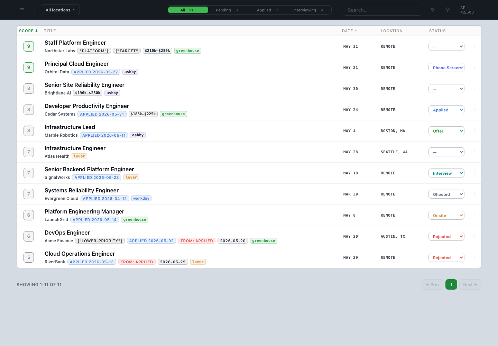

# Sift

Sift is a private, local, AI-powered job-search engine. Self-host it and it runs entirely on your machine: no account, no telemetry, your data stays with you. The hosted multi-tenant code is included in this source-available repo under AGPL-3.0.

It scrapes 11+ job boards (Greenhouse, Lever, Ashby, Workable, Workday, Wellfound, Built In, and more), scores every listing against your resume with Google's free Gemini API, and serves a dashboard at `http://localhost:3131` for review and pipeline tracking.



## Features

- **Scraping.** Pulls fresh listings from 11+ ATS platforms on a schedule.
- **Company discovery.** Gemini suggests companies that fit your profile and verifies their job boards automatically. Want a specific employer added? In Claude Code run `/add-company [name or careers URL]` and it finds the company's ATS board (Greenhouse, Ashby, Lever, or Workday), confirms it is live, and queues it for the next scrape.
- **LLM scoring.** Gemini scores each job 1 to 10 across five dimensions (stack match, seniority, comp, company stage, desirability) grounded in your resume. Deterministic post-processing caps mis-rated roles.
- **Pipeline tracking.** Manual stage transitions from Pending through Applied, Phone Screen, Interview, Onsite, Offer, Rejected, Closed, and Ghosted.
- **Market research.** Aggregate JD analysis against your profile: top skills, seniority signals, comp ranges, and emerging high-score patterns.
- **Gmail rejection sync.** Optional. Watches your inbox and auto-flips matching jobs to `rejected` with the parsed reason.

Final "applied" status is always set by you. The scraper never marks anything as applied.

## Quickstart (Mac)

Open the **Terminal** app and paste in this one line, then press Return:

```bash
/bin/bash -c "$(curl -fsSL https://raw.githubusercontent.com/jakemercure28/job-search-automation/main/install.sh)"
```

That is the whole thing. It installs everything it needs (developer tools,
Homebrew, the OrbStack container runtime), downloads the app, starts it, and
opens the dashboard in your browser by itself. Plan for about 10 to 15 minutes,
one password prompt, and a couple of click-through windows. It is safe to run
again if it stops partway.

Never used Terminal before? A walkthrough of exactly what you'll see, including
how to open Terminal, is in [docs/INSTALL-mac.md](docs/INSTALL-mac.md).

Open **http://localhost:3131**. A setup wizard walks you through adding your Gemini API key, resume, and job targets in the browser.

> **Free Gemini key:** https://aistudio.google.com/apikey. No credit card required. The defaults keep you inside the free tier (500 requests/day).

## Run it yourself (any OS)

The one-liner above is Mac-only, but the app is just a Compose stack and runs anywhere with a Compose v2 runtime (OrbStack, Docker Desktop, colima). To set it up by hand:

```bash
git clone https://github.com/jakemercure28/job-search-automation.git
cd job-search-automation
cp .env.example .env          # then add your free Gemini key
./scripts/setup.sh            # seeds data/ and .context/ from the shipped examples
docker compose up -d --build
```

Then open **http://localhost:3131**. The in-browser setup wizard walks you through your Gemini key, resume, and job targets, so you do not have to edit any files by hand. (You still can: your profile lives in `data/resume.md`, `data/context.md`, and `data/companies.json`.) On a fresh Mac, git needs the Xcode Command Line Tools (`xcode-select --install`).

## Configuration

Everything is in `.env`. Common settings:

| Variable | Default | Purpose |
| --- | --- | --- |
| `GEMINI_API_KEY` | | **Required.** Free key from Google AI Studio. |
| `GEMINI_RATE_DELAY_MS` | `5000` | Throttle between Gemini calls. Lower on a paid key. |
| `GEMINI_HOST_PER_TENANT_DAILY_LIMIT` | `0` | Hosted mode per-tenant cap on shared host-key calls/day (fairness guardrail). |
| `GLOBAL_JOB_SEED_LIMIT` | `100` | Recent global job descriptions copied into a tenant queue before a user-triggered scrape. |
| `LOCATION_FILTER` | | Comma-separated cities to allow. Empty = allow all. |
| `LOCATION_BLOCKLIST` | | Comma-separated cities to drop. |
| `BUILTIN_SUBDOMAIN` | `www` | Built In region (`seattle`, `nyc`, `austin`, etc.). |
| `SCRAPE_SCHEDULE` | `0 */6 * * *` | Cron schedule for Go scrape runs. |
| `GMAIL_EMAIL` / `GMAIL_APP_PASSWORD` | | Optional. Enables rejection email sync. |
| `DASHBOARD_PORT` | `3131` | |

## Updating

To update, run the **same one line you installed with**. It detects your existing
copy in `~/job-search-automation`, makes sure your container engine (OrbStack or
Docker) is running, pulls the latest version, and rebuilds. Your data and
settings stay in place, and the dashboard reopens when it is done.

```bash
/bin/bash -c "$(curl -fsSL https://raw.githubusercontent.com/jakemercure28/job-search-automation/main/install.sh)"
```

**Developers** can update by hand instead, with any running Compose v2 engine
(OrbStack or Docker Desktop):

```bash
cd ~/job-search-automation
git pull
docker compose up -d --build
```

Your editable profile files live in `./data` and survive restarts and rebuilds.
The SQLite database lives in the named Docker volume `job-search-automation_job_search_db`, so it stays on the engine's Linux filesystem instead of a macOS bind mount.

## Development checks

Install dev dependencies before opening a PR:

```bash
npm ci
npm ci --prefix scraper-service
npm run verify
go test ./...
```

`npm run verify` runs ESLint and Prettier's formatting check on the frontend JS,
then type-checks and tests the TypeScript `scraper-service`. `go test ./...`
covers the Go backend (scraper, scorer, dashboard, maintenance).
